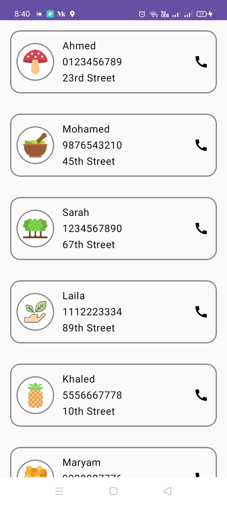
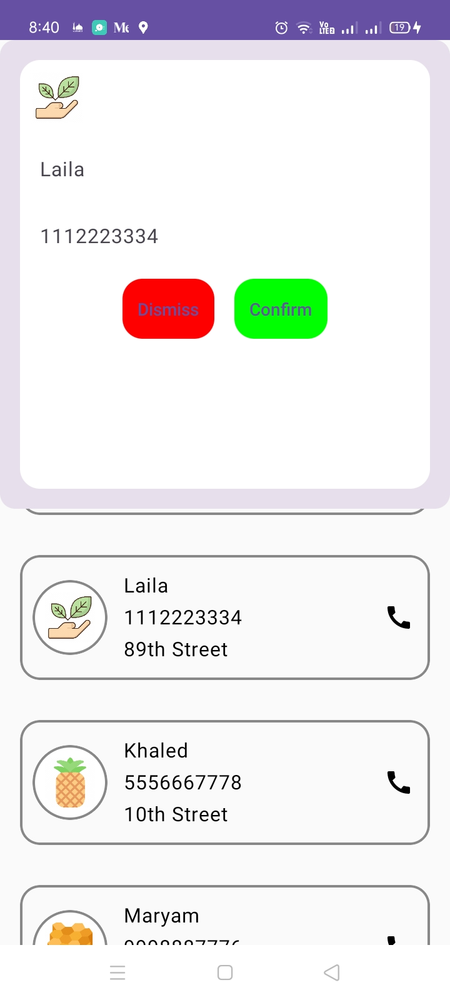

# Simple Contact List in Jetpack Compose

This is a simple Android application created using Jetpack Compose. The project is designed to demonstrate basic usage of Compose for building UI components, managing state, and handling user interactions.

---

## Features

1. **Contact Card**:

   - Displays the contact's name, phone number, address, and profile picture.
   - Uses Jetpack Compose's `Row`, `Column`, and `Box` layouts for a clean and modern UI.
   - Includes material design elements like rounded corners and borders.

2. **LazyColumn**:

   - Efficiently renders a scrollable list of contacts.
   - Dynamically handles large datasets.

3. **Custom Dialog**:

   - Shows a modal dialog with contact details when a contact card is clicked.
   - Provides actions like dismiss and confirm.

4. **State Management**:

   - Utilizes `remember` and `mutableStateOf` to handle UI state changes, such as showing or hiding dialogs.

5. **Integration with Libraries**:
   - Uses **Coil** for loading contact profile images from URLs.

---

## Screenshots

#### Contact List Screen

#### Contact Details Dialog

---

